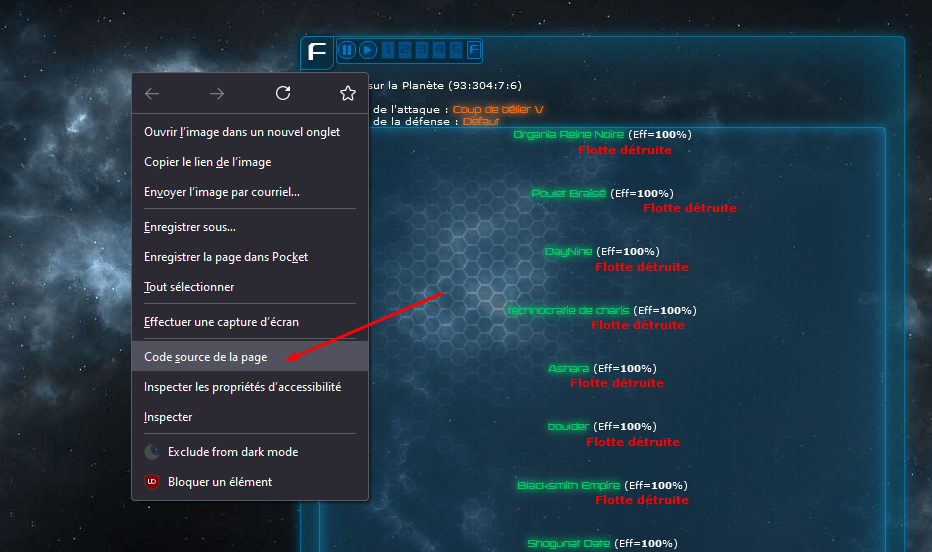
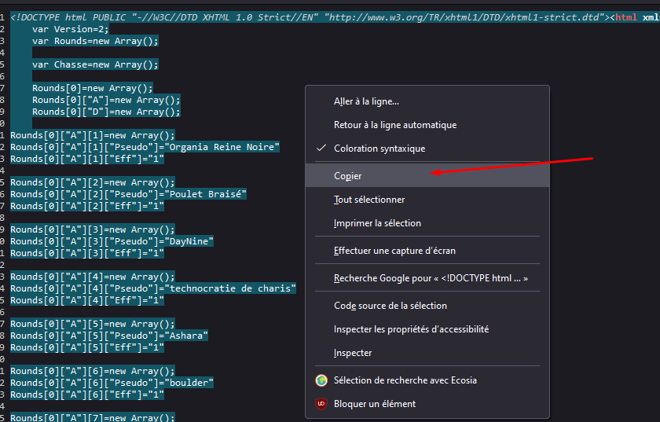

- [Introduction](#introduction)
- [Environnement](#environnement)
  - [1.0.0](#100)
  - [2.0.0](#200)
- [Utilisation](#utilisation)

# Introduction

Ce programme fonctionnant pour un jeu francophone, cette documentation ne sera rédigée qu'en français.

Ce programme à pour objectif de faire un résumé de combat.

| Date       | Version | Description                                                                                                                           | Auteur     |
| ---------- | ------- | ------------------------------------------------------------------------------------------------------------------------------------- | ---------- |
| 18/05/2022 | 1.0.0   | Liste basique des pertes par flotte                                                                                                   | Andromelus |
| 27/05/2022 | 2.0.0   | Peut prendre en compte un ou plusieurs rapports de combat. Ne classe plus les joueurs par attaquants/défenseurs dans le calcul final. | Andromelus |
| 30/05/2022 | 2.1.0   | Récupère la quantité de ressources pillées (perdues par le premier défenseur)                                                         | Andromelus |
| 05/06/2022 | 2.1.0   | Vérification de version et pillage d'objet                                                                                            | Andromelus |

# Environnement

## 1.0.0
Ce programme est écrit en [AWK](https://fr.wikipedia.org/wiki/Awk).

Awk n'est (à ma connaissance) pas disponible nativement sous Windows, mais l'est (dans de nombreuses distributions) sous Linux.

Pour obtenir Awk sous Windows, vous pouvez installer WSL ou bien Git bash (qui fourni un Awk).

Ce programme a été développé sous:

``GNU Awk 5.0.0, API: 2.0 (GNU MPFR 4.1.0, GNU MP 6.2.1)``

Le fonctionnement sous une autre version/dérivé de Awk n'est pas assuré.

## 2.0.0

A partir de cette version, le programme nécessite bash. Développé avec `GNU bash, version 4.4.23(1)-release (x86_64-pc-msys)`. Le fonctionnement avec une autre version de bash n'est pas assurée.

# Utilisation

- Récupére l'ensemble des fichiers (ou au minimum, le contenu le dossier nommé `src` et `run.sh`)
- Télécharger le code source de la page web d'un combat
    - Ouvrez le rapport de combat
    - Affichez le code source de la page

    - Copier tout le contenu de la page et sauvegardez le dans un fichier stocké dans un dossier nommé `reports`, situé au même niveau que ``stats.awk``

    - Lancez le script avec la commande suivante: ``bash run.sh``