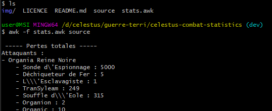

- [Introduction](#introduction)
- [Environnement](#environnement)
- [Utilisation](#utilisation)

# Introduction

Ce programme fonctionnant pour un jeu francophone, cette documentation ne sera rédigée qu'en français.

Ce programme à pour objectif de faire un résumé de combat.

| Date       | Version | Description                         | Auteur     |
|------------|---------|-------------------------------------|------------|
| 18/05/2022 | 1.0.0   | Liste basique des pertes par flotte | Andromelus |

# Environnement

Ce programme est écrit en [AWK](https://fr.wikipedia.org/wiki/Awk).

Awk n'est (à ma connaissance) pas disponible nativement sous Windows, mais l'est (dans de nombreuses distributions) sous Linux.

Pour obtenir Awk sous Windows, vous pouvez installer WSL ou bien Git bash (qui fourni un Awk).

Ce programme a été développé sous:

``GNU Awk 5.0.0, API: 2.0 (GNU MPFR 4.1.0, GNU MP 6.2.1)``

Le fonctionnement sous une autre version/dérivé de Awk n'est pas assuré.

# Utilisation

- Récupére le script ``stats.awk``
- Télécharger le code source de la page web d'un combat
    - Ouvrez le rapport de combat
    - Affichez le code source de la page

    - Copier tout le contenu de la page et sauvegardez le dans un fichier au même niveau que le script ``stats.awk`` (dans la suite de cet exemple, le fichier se nomme "source")

    - Lancez le script avec la commande suivante: ``awk -f stats.awk source``
